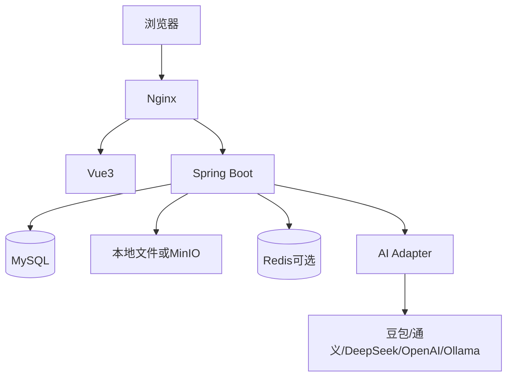

# 系统架构
采用模块化单体，而非微服务。

```mermaid
flowchart TB
U[浏览器]-->N[Nginx]
N-->V[Vue3]
N-->B[Spring Boot]
B-->M[(MySQL)]
B-->F[本地文件或MinIO]
B-->R[(Redis可选)]
B-->A[AI Adapter]
A-->P[豆包/通义/DeepSeek/OpenAI/Ollama]
```

后端分层：interfaces、application、domain、infrastructure、common。
模块：student、academic、score、wrongquestion、review、knowledge、mastery、resource、ai、attachment、backup、dashboard、system。
